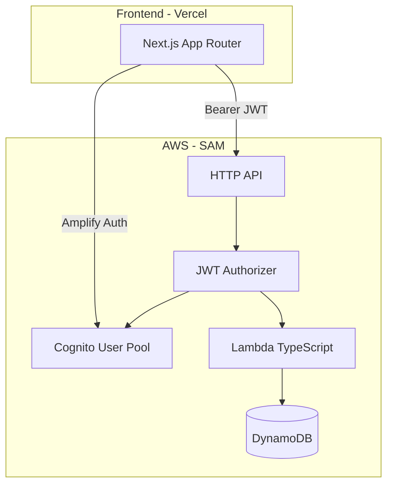

# ApplyTrack

Kanban-style job application tracker with **Amazon Cognito** auth and a **serverless AWS** backend (Lambda, API Gateway, DynamoDB).



## Features

- Sign up / log in with email (Cognito + email verification)
- Kanban pipeline: **Saved → Applied → Interview → Offer → Rejected**
- Add, edit, delete applications with company, role, dates, URL, notes
- Status dropdown on each card moves applications between columns
- Search by company or role
- Per-user data isolation via JWT `sub` claim in DynamoDB

## Stack

| Layer | Tech |
|-------|------|
| Frontend | Next.js 16, React 19, Tailwind 4, AWS Amplify Auth |
| Backend | AWS Lambda (Node 20), API Gateway HTTP API, DynamoDB |
| Auth | Amazon Cognito User Pool + JWT authorizer |
| Infra | AWS SAM |
| Hosting | Vercel (frontend) + AWS (API) |

## Prerequisites

- Node.js 20+
- [AWS CLI](https://docs.aws.amazon.com/cli/latest/userguide/getting-started-install.html) configured (`aws configure`)
- [AWS SAM CLI](https://docs.aws.amazon.com/serverless-application-model/latest/developerguide/install-sam-cli.html)
- Vercel account (optional, for frontend deploy)

## 1. Deploy the AWS backend

```bash
cd backend
cp samconfig.toml.example samconfig.toml
npm install
sam build
sam deploy --guided
```

During `--guided`, set:
- **Stack name:** `applytrack`
- **Region:** `us-east-1`
- **FrontendOrigin:** `http://localhost:3000` (update to your Vercel URL after frontend deploy)

Save the outputs:

| Output | Env var |
|--------|---------|
| `UserPoolId` | `NEXT_PUBLIC_COGNITO_USER_POOL_ID` |
| `UserPoolClientId` | `NEXT_PUBLIC_COGNITO_CLIENT_ID` |
| `ApiUrl` | `NEXT_PUBLIC_API_URL` |
| `AwsRegion` | `NEXT_PUBLIC_AWS_REGION` |

### Update CORS after Vercel deploy

Redeploy the backend with your production frontend URL:

```bash
sam deploy --parameter-overrides FrontendOrigin="https://your-app.vercel.app"
```

## 2. Run the frontend locally

```bash
cd frontend
cp .env.local.example .env.local
# Fill in Cognito + API values from SAM outputs
npm install
npm run dev
```

Open [http://localhost:3000](http://localhost:3000).

## 3. Deploy frontend to Vercel

```bash
cd frontend
npx vercel
```

Set the same environment variables in the Vercel project settings, then redeploy.

## Project structure

```
applytrack/
├── backend/
│   ├── template.yaml       # SAM: Cognito, API, Lambda, DynamoDB
│   └── src/
│       ├── handler.ts      # Lambda entry
│       ├── router.ts       # HTTP routing
│       └── db.ts           # DynamoDB CRUD
└── frontend/
    └── src/
        ├── app/            # login, signup, board pages
        ├── components/     # Kanban UI
        ├── hooks/          # useAuth, useApplications
        └── lib/            # Amplify, API client
```

## API

All routes require `Authorization: Bearer <Cognito ID token>`.

| Method | Path | Description |
|--------|------|-------------|
| GET | `/applications` | List user's applications |
| POST | `/applications` | Create application |
| PUT | `/applications/{id}` | Update application |
| DELETE | `/applications/{id}` | Delete application |

## Auth flow

1. User signs up → Cognito sends verification email
2. User confirms code → logs in via Amplify Auth
3. Frontend sends Cognito **ID token** on each API request
4. API Gateway JWT authorizer validates token against Cognito
5. Lambda reads `sub` from JWT and scopes DynamoDB queries to `USER#<sub>`

## Local backend testing

```bash
cd backend
sam build
sam local start-api
```

Use a Cognito ID token from a logged-in session in the `Authorization` header.

## Roadmap

- Drag-and-drop between columns
- CSV export (S3)
- Interview follow-up reminders (SES)
- Cognito social login (Google)

## License

MIT
